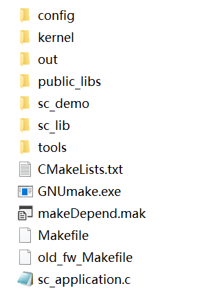
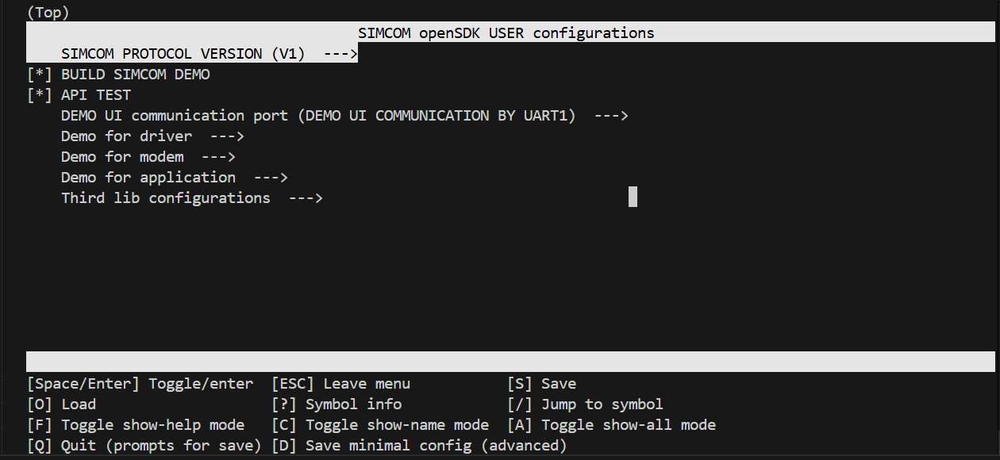
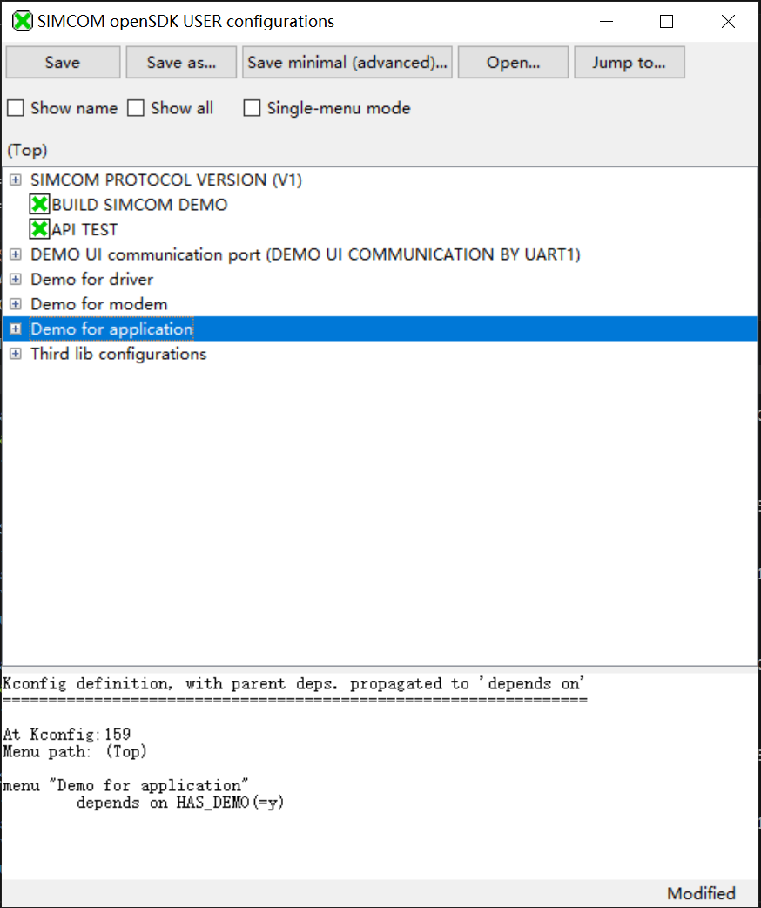
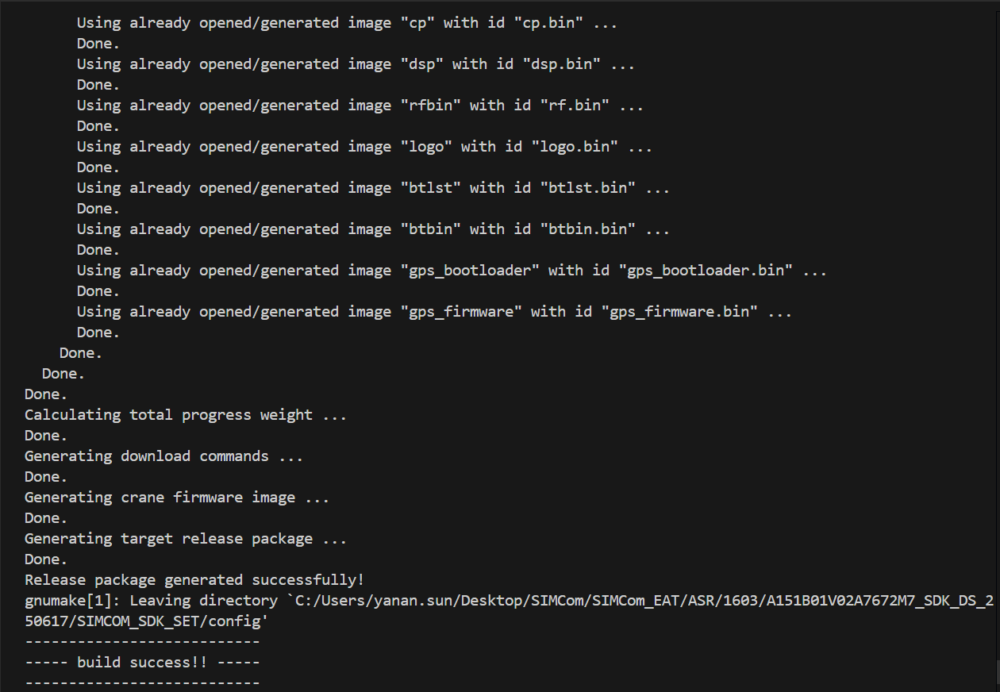
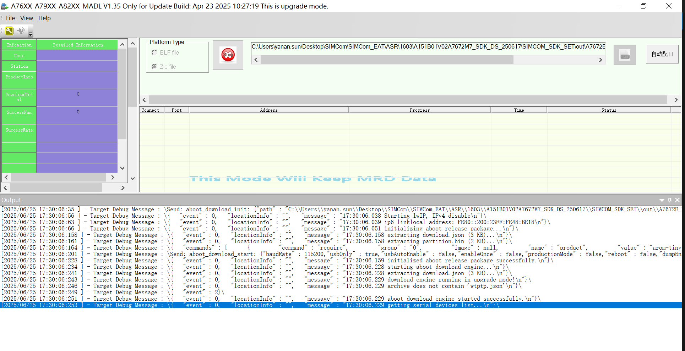

<h1 style="text-align:center">A76XX OpenSDK</h1>

A76XX OpenSDK solution is based on A76XX CAT-1 module which allows customer to run application code inside module for smart IoT applications. All A76XX CAT-1 modules could support OpenSDK,you can get module list from [SIMCom Website](https://en.simcom.com/module/4g.html).For more technical support you can contact with [SIMCom support team](https://en.simcom.com/service_cat-20.html).


[OpenSDK Supported Features](#opensdk-supported-features)<br>
[OpenSDK Hardware Design Manual](#opensdk-hardware-design-manual)<br>
[OpenSDK Architecture](#opensdk-architecture)<br>
[OpenSDK Download](#opensdk-download)<br>
[OpenSDK Compile and Image Update](#opensdk-compile-and-image-update)<br>
 - [SDK Compile under Windows OS](#sdk-compile-under-windows-os)<br>
 - [SDK Compile under Linux OS](#sdk-compile-under-linux-os)<br>
 - [SDK Image Update](#sdk-image-update)<br>
  
[OpenSDK Debug](#opensdk-debug)<br>

# OpenSDK Supported Features
<br>

|Feature|Description|Note|
|---|---|---|
|[GPIO](_htmresc/AN_GPIO.md)|For gpio map please find header file from sc_lib\inc\GPIO|Please refer to corresponding HD for OpenSDK application,see `demo_gpio.c`
|[ADC](_htmresc/AN_ADC.md)|There is general ADC and VBAT ADC|For VBAT ADC customer must follow the referrence circuit from HD,see `demo_gps.c`
|[UART](_htmresc/AN_UART.md)|UART1--Main UART<br>UART2--Dedicate for debug purpose<br>UART3--For GNSS |For modules without GNSS,UART3 can be used by customer application,see `uart_api.c\demo_uart.c`
|[I2C](_htmresc/AN_I2C.md)|Support up to 400KHz|Only for master role,see `demo_i2c.c`
|[SPI](_htmresc/AN_SPI.md)|There are 2 SPI interfaces,one for LCD and one for general purpose|For LCD application need special MMI SDK,please contact with [SIMCom Support](https://en.simcom.com/service_cat-20.html),see `demo_spi.c`
|LCD|Support SPI 3\4 line LCD|Driver supported on ST7735\S7789 series,see `demo_lcd.c`
|Audio|Support Analog and Digital Audio|see `demo_audio.c`
|BT\BLE|Support classic BT and BLE 4.0\5.0(server\client)|For BT only SPP profile supported,see `demo_ble.c\demo_bt_stack.c\demo_bt.c`
|Network|Network management|see `demo_network.c`
|FTP|Support FTP and FTPS(TLS1.2)|see `demo_ftps.c\demo_ftps_test.c`
|HTTP|Support HTTP and HTTPS(TLS1.2)|see `demo_https.c`
|GNSS|Support UC6228 and ASR5311 with different module PN|see `demo_gps.c`
|MQTT|Support up to 2 connection,support MQTTS|see `demo_mqtt.c`
|NTP|Update time with NTP|see `demo_ntp.c`
|RF TX\RX|TX\RX power measurement|see `demo_txrx_power.c`
|Flash|Direct flash read\write\erase|see `demo_flash.c`
|PWM|Support up to 4 channels|see `demo_pwm.c`
|OS|Support task\semaphore\queue\mutex\flag\timer\memory management|see `demo_system.c`
|SIM Card|Could support DSDS\DSSS|see `demo_simcard.c`
|SMS|Short Message|see `demo_sms.c`
|SSL|Support up to TLS1.3|see `demo_ssl.c\demo_ssl_test.c\demo_mbedtls.c`
|TCP\IP|Support TCP client\server and UDP client|see `demo_tcpip.c`
|TTS|Text to speech with local and remote|Only support Chinese\English,see `demo_tts.c`
|Voice Call|Support CS\VOLTE|see `demo_call.c`
|WiFi Scan|Module scan wifi AP info with cellular B140 and get SSID\RSSI which can be used for WiFi Location|Only Wifi RX supported,no TX.Only specific hardware PN could support it,see `demo_wifi.c`
|Power management|Module power control|see `demo_pm.c`
|JD|Jamming Detection|see `demo_shdr.c`
|LBS|Location based on cellular cell scaning|see `demo_loc.c\demo_loc_test.c`
|Data Call|Support IP\IPV6\IPV4V6 with different PDP|PPP\RNDIS\ECM,driver support on Windows\Linux
|File System|Support standard fs operation|see `demo_file_system.c`
|FOTA|Support both SDK core and app update|see `demo_fota.c\demo_app_download.c\demo_app_updater.c`
|HTP|Update time with HTTP|see `demo_ftp.c`
|PING|Support IPV4\V6|see `demo_ping.c`
|RTC|Support RTC alarm to wake up module from sleep mode|see `demo_rtc.c`
|USB|Write\Read from USB_AT interface|For OpenSDK application,as default USB_AT interface will not support AT cmd,while you can use USB_Modem port instead,see `cus_usb_vcom.c`
|Watchdog|Hardware Watchdog,support up to 60 seconds timer configuration|see `demo_wtd.c`
|Camera|Camera Driver|Only for MMI version of SDK and dedicate hardware,see `demo_cam_driver.c\demo_cam.c`
|POC|POC application with PCM play\record|see `demo_poc.c`
|Public lib|cjson\zlib\sm2\miracl|see `demo_zlib.c\demo_cjson.c\demo_crypto.c`
|OneWire|Onewire protocol for sensor like DS18B20|see `demo_onewire.c`

<br>

# OpenSDK Hardware Design Manual
<br>
A hardware design manual is usually needed when a developer starts to evaluate the peripheral interfaces used for application.With SIMCom A76XX CAT-1 module there are 2 typical applications,Standard and OpenSDK.For standard application there is a host processor(CPU\MCU\MPU) which will comunicate with module over AT cmd via UART\USB interface, while for OpenSDK application usually there is no external host to control module and it runs application code to manage avaliable peripherals inside module. The hardware design manual(HD) for both application is different due to some IO\feature differences.

You can request OpenSDK HD for specific modules from [SIMCom support team](https://en.simcom.com/service_cat-20.html).Here are some general OpenSDK HD files for A7672x\A7602x\A7683x\A7676x series(continue updating).

[OpenSDK HD](https://1drv.ms/f/c/1964fa2b798f638e/EjjekV7eIWFIsTU_6Qdv4NQByvkphD0XEcp4LE92QgxZiQ?e=5uMjff)
<br>

# OpenSDK Architecture
<br>


|File or path name|Description
|---|---|
|config|contains compile\link script,cmake tool configuration files|
|config\\xxx.ld|linking script for specific module|
|config\\Kconfig|configuration file for kconfig,used for menuconfig|
|config\\.config|the configuration file generated by kconfig,you can also modify it directly|
|config\\buildCusLib.mak<br>config\\image.mak<br>config\\package.mak<br>config\\ToolChain.mak|for old version of SDK(A011),now not in use|
|config\\buildOptions.cmake|default module compilation switch,work together with userspaceConfig.h|
|config\\Config_APP.cmake|default APP compilation switch|
|config\\make_image_16xx.mak<br>config\\make_image_16xx_settings.mak|script for package|
|config\\ToolChain.cmake|APP compilation script toolchain and parameter configuration|
|config\\userspaceConfig.h|The preset module compilation switch automatically generates header files. Generated at compile time.The code uses the preset switch and needs to include this header file|
|config\\userspaceConfig.h.in|APP macro,work together with buildOptions.cmake|
|kernel|image files needed to generate burn.zip file|
|out|output folder with customer app\\xx.zip\map file|
|public_libs|some public libs used,for example cjson\\zlib|
|sc_demo\\examples|exmples for mqtt\\ssl\\uart,not involved in compilation|
|sc_demo\\old_fw|makefile files for old version of SDK(A011),now not in use|
|sc_demo\\V1|V1 version of demo code|
|sc_demo\\V2|V2 version of demo code|
|sc_lib|static libs and header files|
|tools|windows\\linux compile and package tool|
|CMakeLists.txt|cmake script entry for code compilation|
|GNUmake.exe|make tool|
|makeDepend.mak|The dependency file of the Makefile|
|Makefile|entry for cmake file|
|old_fw_Makefile|make file for old version of SDK(A011),now not in use|
|sc_application.c|code entry for customer application|
<br>
# OpenSDK Download
<br>

As the memory size\\supported features\\pin-map are different with SIMCom A76XX CAT-1 modules,the SDK is not the same,you need to get correct SDK according to the modules you are testing with from SIMCom FAE,or you can request from [SIMCom support team](https://en.simcom.com/service_cat-20.html).
For a starter you can download SDK for [A7672E_FASE series](https://1drv.ms/u/c/1964fa2b798f638e/Ea7ewzYUAE1FjetKI9B0BloByShniIUSHx_LJs3fYTpUEQ?e=JKU6Y9) for trail purpose.

<br>

# OpenSDK Compile and Image Update
<br>

**⚠️ Note: Please make sure no non-ASICC and space character in SDK path**
## *SDK Compile under Windows OS*
1. Please copy GNUmake.exe file from SDK root path to `C:\Windows\System32` and `C:\Windows\SysWOW64` folders.
2. Run CMD line and check `gnumake -v` command to see if gnumake tool has been installed well.You will see following messages if gnumake is correctly installed.
   ```cmd
    GNU Make 3.81
    Copyright (C) 2006  Free Software Foundation, Inc.
    This is free software; see the source for copying conditions.
    There is NO warranty; not even for MERCHANTABILITY or FITNESS FOR A
    PARTICULAR PURPOSE.

    This program built for i386-pc-mingw32
    ```
3. CD to \<SDK\>\SIMCOM_SDK_SET\ and run `gnumake.exe`,for first time compiling it will setup the enviroment automatically,later it will list the help info including supported module list with current SDK.
   
   ```
   -  build method: gnumake [target]
   -  target:[module],[clean option]
   -
   -  module list:
   -      A7672E_MASA_1603_V101_OPENSDK
   -      A7672SA_MASA_1603_V101_OPENSDK
   -
   -  config option list:
   -      menuconfig            [do menuconfig for app]
   -      guiconfig             [do guiconfig for app]
   -      clean_config          [clean the userconfig]
   -
   -  clean option list:
   -      clean                 [clean all modules.]
   -      clean_[module]        [clean a module.]
    ```
4. If need visual compilation configuration for SDK,you can use Kconfig and Python plugin to configure with `menuconfig` or `guiconfig`.Need to install Python 3.8.5 or higher version,then install following plugins for Python.
   ```python
   pip install windows-curses
   pip install kconfiglib
   ```
   * ***With menuconfig***<br>

   Run `gnumake menuconfig` to start and use 'j'\'k'\'h'\'l' on keyboard to navigate items, use space\\ESC character to select\\exit menu items. When finished press 'S' to save the config file.

   

   |Menu|Description|
   |---|---|
   |SIMCOM PROTOCOL VERSION|Choose demo code version,V1 or V2|
   |BUILD SIMCOM DEMO|Choose whether need to build simcom demos|
   |API TEST|For simcom internal use,default enabled|
   |DEMO UI communication port|Choose which port for UI CLI,main UART or USB_AT port|
   |Demo for driver|Switch for peripheral device drivers to compile|
   |Demo for modem|Switch for modem services to compile|
   |Demo for application|Switch for application demo to compile|
   |Third lib configurations|Switch for third party lib| <br>

   * ***With guiconfig***<br>

   Run `gnumake guiconfig` to start and use mouse to select the items. When finished click "Save" to save the config file.

    

5. Run `gnumake <target>` to start compiling,the target string must be one of supported module list after running `gnumake`. For example `gnumake A7672E_MASA_1603_V101_OPENSDK`,when finished and without error,will get "build success!!" in end of cmd terminal.

  

## *SDK Compile under Linux OS*

Please make sure Linux has installed make and python tool,it is similar as with Windows,you need cd to \<SDK\>\SIMCOM_SDK_SET\ and run `make`,for first time compiling it will setup the enviroment automatically,later it will list the help info including supported module list with current SDK,then run `make <target>` to start compiling,the target string must be one of supported module list after running `make`. For example `make A7672E_MASA_1603_V101_OPENSDK`,when finished and without error,will get "build success!!" in end of cmd terminal.
## *SDK Image Update*
After successful compiling,you will find some .zip file in out\\\<target\>\\ folder,the burn.zip should be flashed to module, and the burn_factory.zip file is only used when you need to flash SDK FW with your application in SIMCom factory. To flash burn.zip file,currently only Windows tool is avaliable,need to download SIMCom MADL tool from [here](https://1drv.ms/f/c/1964fa2b798f638e/EtW9qCYHss9Fq6iqoo_T_DkBTYLXsLHvE66XNyu6sLsgZA?e=RL3AVg),follow the user guide inside tool package to flash image.<br><br>

<br>

# OpenSDK Debug
<br>
