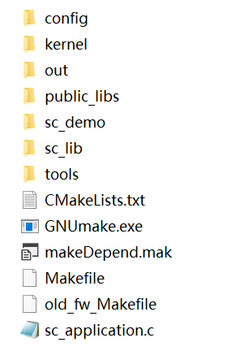
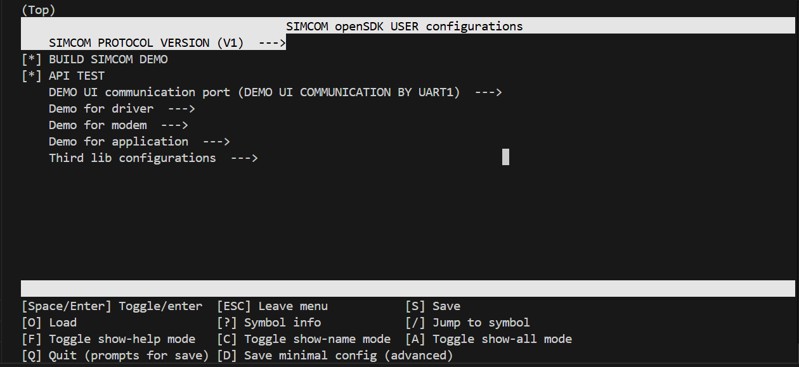
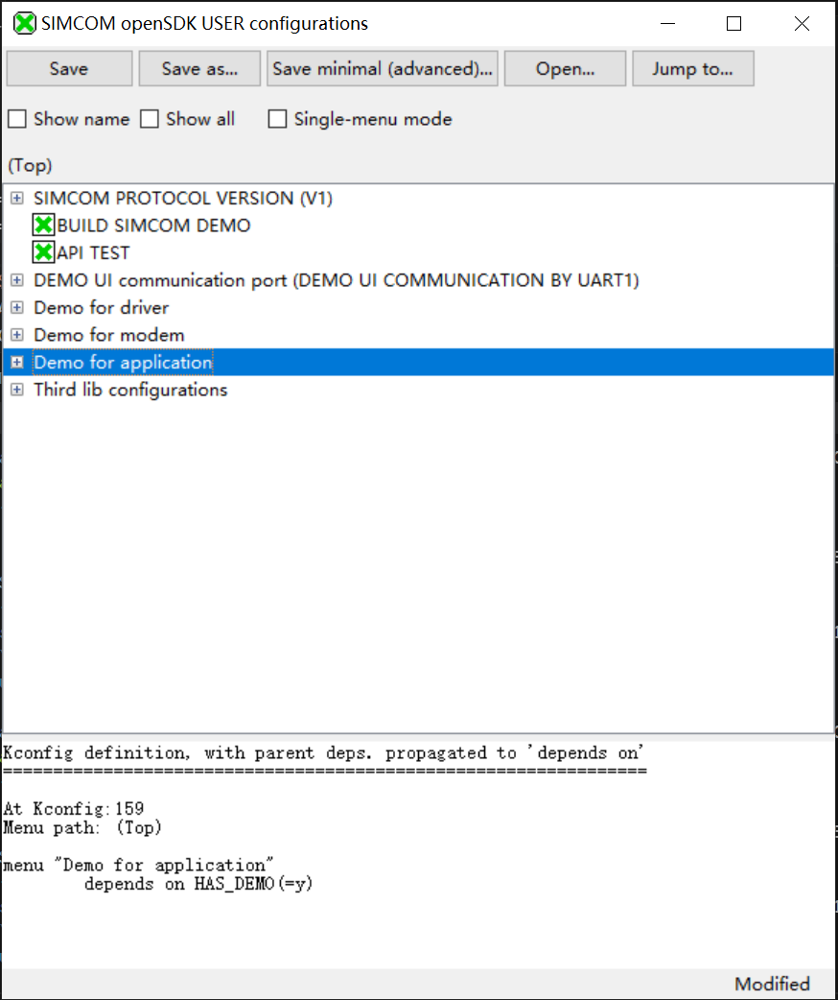
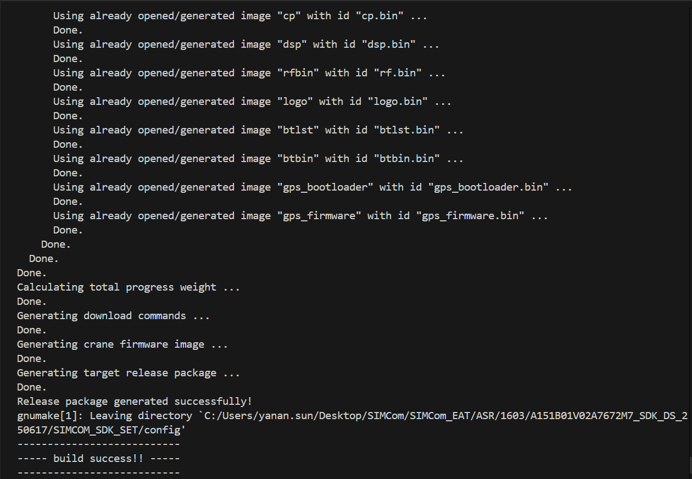
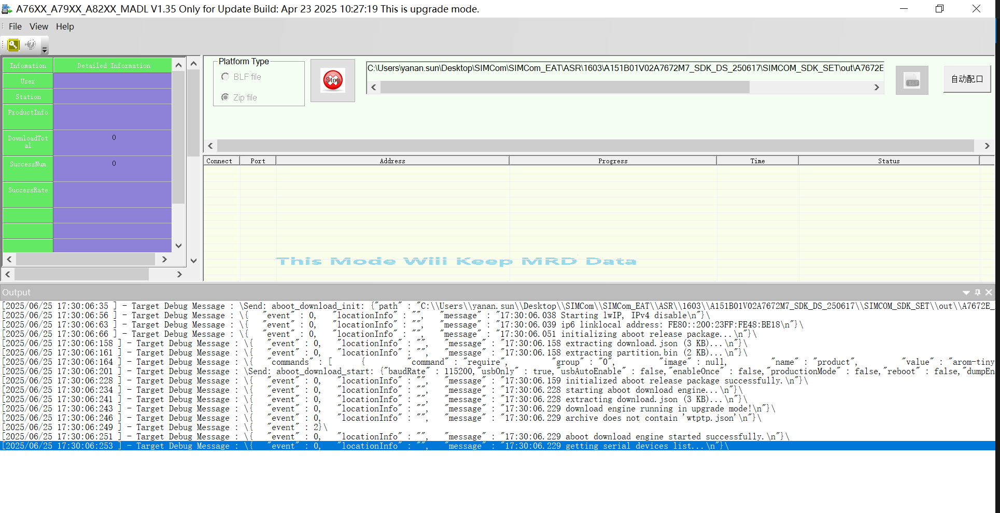
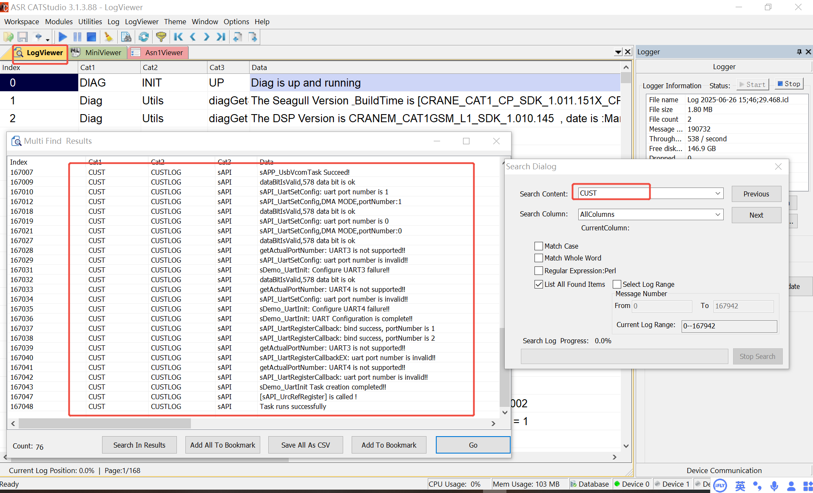
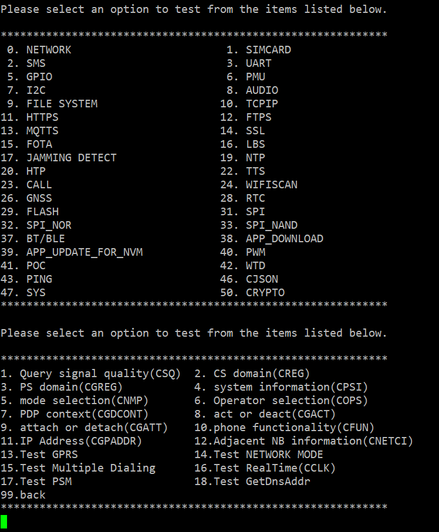
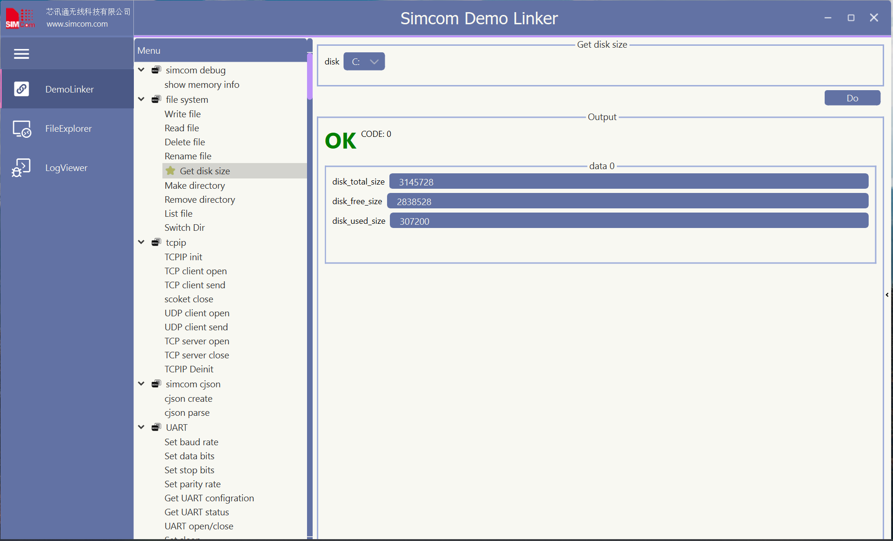

<h1 style="text-align:center">A76XX OpenSDK</h1>

A76XX OpenSDK solution is based on A76XX CAT-1 module which allows customer to run application code inside module for smart IoT applications. All A76XX CAT-1 modules could support OpenSDK, you can get module list from [SIMCom Website](https://en.simcom.com/module/4g.html). For more technical support you can contact with [SIMCom support team](https://en.simcom.com/service_cat-20.html).


[OpenSDK Supported Features](#opensdk-supported-features)<br>
[OpenSDK Hardware Design Manual](#opensdk-hardware-design-manual)<br>
[OpenSDK Architecture](#opensdk-architecture)<br>
[OpenSDK Download](#opensdk-download)<br>
[OpenSDK Compile and Image Update](#opensdk-compile-and-image-update)<br>
 - [SDK Compile under Windows OS](#sdk-compile-under-windows-os)<br>
 - [SDK Compile under Linux OS](#sdk-compile-under-linux-os)<br>
 - [SDK Image Update](#sdk-image-update)<br>
  
[OpenSDK Debug](#opensdk-debug)<br>
[OpenSDK Demo](#opensdk-demo)<br>
[OpenSDK Examples](#opensdk-examples)<br>
[OpenSDK Q&A](#qa)<br>

# OpenSDK Supported Features
<br>


## Framework / Utility

| File | Description |
|------|-------------|
| [simcom_demo.md](_htmresc\simcom_demo.md) | Central demo task manager and interactive CLI UI framework |
| [uart_api.md](_htmresc\uart_api.md) | UART initialization, circular data cache, and input reading helpers |
| [cus_urc.md](_htmresc\cus_urc.md) | URC (Unsolicited Result Code) processing framework |
| [cus_usb_vcom.md](_htmresc\cus_usb_vcom.md) | USB Virtual COM Port communication |
| [demo_helloworld.md](_htmresc\demo_helloworld.md) | Minimal entry-point demo for getting started |

## Bluetooth & BLE

| File | Description |
|------|-------------|
| [demo_bt.md](_htmresc\demo_bt.md) | Classic Bluetooth: adapter control, inquiry, pairing, SPP |
| [demo_bt_stack.md](_htmresc\demo_bt_stack.md) | BTstack dual-mode: BT + BLE peripheral/central GATT |
| [demo_ble.md](_htmresc\demo_ble.md) | Standalone BLE: advertising, custom GATT service, notify/indicate |

## Audio & Voice

| File | Description |
|------|-------------|
| [demo_audio.md](_htmresc\demo_audio.md) | Audio playback, recording, volume, mic gain, echo suppression |
| [demo_tts.md](_htmresc\demo_tts.md) | Text-to-Speech playback and parameter control |
| [demo_call.md](_htmresc\demo_call.md) | Voice call: dial, answer, hang up, auto-answer, DTMF |
| [demo_poc.md](_htmresc\demo_poc.md) | Push-to-Talk (POC): low-level PCM playback and recording |

## Messaging

| File | Description |
|------|-------------|
| [demo_sms.md](_htmresc\demo_sms.md) | SMS full lifecycle: init, write, read, send, delete, PDU encoding |

## Networking & TCP/IP

| File | Description |
|------|-------------|
| [demo_network.md](_htmresc\demo_network.md) | Cellular network management: CSQ, CREG, APN, PDP, PSM |
| [demo_tcpip.md](_htmresc\demo_tcpip.md) | TCP/UDP sockets, DNS resolution, dual-stack IPv4/IPv6 |
| [demo_ping.md](_htmresc\demo_ping.md) | ICMP ping with callback-based result reporting |
| [demo_pppd.md](_htmresc\demo_pppd.md) | PPP dial-up for GPRS data connection |

## MQTT

| File | Description |
|------|-------------|
| [demo_mqtt.md](_htmresc\demo_mqtt.md) | MQTT/MQTTS: connect, publish, subscribe, Aliyun/Tencent/OneNET demos |
| [demo_auto_mqtt.md](_htmresc\demo_auto_mqtt.md) | Automated MQTT stress test with offline notification |
| [mqtt_OneNET.md](_htmresc\mqtt_OneNET.md) | OneNET cloud platform integration with HMAC-SHA1 token |
| [mqtt_tencent.md](_htmresc\mqtt_tencent.md) | Tencent Cloud IoT integration with HMAC-SHA1 auth |

## HTTP / HTTPS / FTPS

| File | Description |
|------|-------------|
| [demo_https.md](_htmresc\demo_https.md) | HTTP/HTTPS client: GET, POST, file upload, header management |
| [demo_ftps.md](_htmresc\demo_ftps.md) | FTP/FTPS: login, list, download, upload, directory operations |
| [demo_ftps_test.md](_htmresc\demo_ftps_test.md) | Automated FTPS stress test with semaphore-driven task loop |
| [demo_htp.md](_htmresc\demo_htp.md) | HTTP Time Protocol client for time synchronization |

## SSL / TLS

| File | Description |
|------|-------------|
| [demo_ssl.md](_htmresc\demo_ssl.md) | SSL/TLS: one-way and two-way authentication, handshake, read/send |
| [demo_ssl_test.md](_htmresc\demo_ssl_test.md) | Automated SSL stress test |

## Time & Location

| File | Description |
|------|-------------|
| [demo_ntp.md](_htmresc\demo_ntp.md) | NTP time synchronization |
| [demo_rtc.md](_htmresc\demo_rtc.md) | Real-time clock: set/get time, alarm, UTC conversion |
| [demo_gps.md](_htmresc\demo_gps.md) | GNSS control: power, modes, AGPS, ephemeris, constellation config |
| [demo_loc.md](_htmresc\demo_loc.md) | LBS location via cell tower triangulation |
| [demo_loc_test.md](_htmresc\demo_loc_test.md) | LBS automated test with background task |

## GPIO & Peripherals

| File | Description |
|------|-------------|
| [demo_gpio.md](_htmresc\demo_gpio.md) | GPIO: direction, level, interrupt, wakeup, bulk pin test |
| [demo_i2c.md](_htmresc\demo_i2c.md) | I2C bus read/write with NAU8810 codec target |
| [demo_spi.md](_htmresc\demo_spi.md) | SPI: flash ID, NOR flash, and NAND flash operations |
| [demo_uart.md](_htmresc\demo_uart.md) | UART: baud/data/parity/stop config, sleep control, RS485 |
| [demo_pwm.md](_htmresc\demo_pwm.md) | PWM output: frequency and duty cycle control |
| [demo_onewire.md](_htmresc\demo_onewire.md) | 1-Wire protocol for CT1820B temperature sensor |

## Display & Camera

| File | Description |
|------|-------------|
| [demo_lcd.md](_htmresc\demo_lcd.md) | LCD display: ST7735S, ST7789V, ST7567A, ST7796u controllers |
| [demo_cam.md](_htmresc\demo_cam.md) | Camera: capture, preview, barcode scanning |
| [demo_cam_dirver.md](_htmresc\demo_cam_dirver.md) | Custom GC032A camera sensor driver with register tables |

## SIM & Telecom

| File | Description |
|------|-------------|
| [demo_simcard.md](_htmresc\demo_simcard.md) | SIM card: PIN, ICCID, IMSI, hot-swap, CRSM, dual-SIM |
| [demo_sjdr.md](_htmresc\demo_sjdr.md) | RF jamming detection with callback notification |

## Wi-Fi

| File | Description |
|------|-------------|
| [demo_wifi_ap.md](_htmresc\demo_wifi_ap.md) | Wi-Fi AP configuration: SSID, WPA2, client management |
| [demo_wifiscan.md](_htmresc\demo_wifiscan.md) | Wi-Fi scanning for location services (RSSI, MAC, channel) |

## Security & Crypto

| File | Description |
|------|-------------|
| [demo_crypto.md](_htmresc\demo_crypto.md) | Hardware crypto engine: AES, random number generation |
| [demo_mbedtls.md](_htmresc\demo_mbedtls.md) | mbedTLS: RSA encrypt/decrypt, AES-ECB, MD hash |
| [demo_sm2.md](_htmresc\demo_sm2.md) | SM2 elliptic curve: key generation, encrypt, decrypt |

## File System & Storage

| File | Description |
|------|-------------|
| [demo_file_system.md](_htmresc\demo_file_system.md) | File operations: open, read, write, stat, directory listing |
| [demo_flash.md](_htmresc\demo_flash.md) | Flash memory: erase, read, write raw sectors |
| [demo_exfs.md](_htmresc\demo_exfs.md) | External flash file system mounting (NOR LFS, NAND YAFFS) |

## Firmware Update

| File | Description |
|------|-------------|
| [demo_fota.md](_htmresc\demo_fota.md) | Firmware OTA: FTP/HTTP/local update, image write, verify |
| [demo_app_download.md](_htmresc\demo_app_download.md) | App firmware download and package management |
| [demo_app_updater.md](_htmresc\demo_app_updater.md) | App firmware update from downloaded package |

## Power & System

| File | Description |
|------|-------------|
| [demo_pm.md](_htmresc\demo_pm.md) | Power management: power key, ADC, VBAT, VDD_AUX, reset |
| [demo_wtd.md](_htmresc\demo_wtd.md) | Watchdog timer: timeout, enable, feed, disable |
| [demo_txrx_power.md](_htmresc\demo_txrx_power.md) | RF TX/RX power level measurement (FALCON_1803 only) |
| [demo_system.md](_htmresc\demo_system.md) | System info: task stack monitoring |

## Data Processing

| File | Description |
|------|-------------|
| [demo_cjson.md](_htmresc\demo_cjson.md) | cJSON: parse, create, modify JSON documents |
| [demo_zlib.md](_htmresc\demo_zlib.md) | zlib: compress/decompress, zip file creation and extraction |

<br>

# OpenSDK Hardware Design Manual
<br>
A hardware design manual is usually needed when a developer starts to evaluate the peripheral interfaces used for application. With SIMCom A76XX CAT-1 module there are 2 typical applications, Standard and OpenSDK. For standard application there is a host processor (CPU/MCU/MPU) which will comunicate with module over AT cmd via UART/USB interface, while for OpenSDK application usually there is no external host to control module and it runs application code to manage avaliable peripherals inside module. The hardware design manual (HD) for both application is different due to some IO/feature differences.

You can request OpenSDK HD for specific modules from [SIMCom support team](https://en.simcom.com/service_cat-20.html). Here are some general OpenSDK HD files for A7672x/A7602x/A7683x/A7676x series (continue updating).

[OpenSDK HD](https://1drv.ms/f/c/1964fa2b798f638e/EjjekV7eIWFIsTU_6Qdv4NQByvkphD0XEcp4LE92QgxZiQ?e=5uMjff)
<br>

# OpenSDK Architecture
<br>


|File or path name|Description
|---|---|
|config|contains compile/link script, cmake tool configuration files|
|config\\xxx.ld|linking script for specific module|
|config\\Kconfig|configuration file for kconfig, used for menuconfig|
|config\\.config|the configuration file generated by kconfig, you can also modify it directly|
|config\\buildCusLib.mak<br>config\\image.mak<br>config\\package.mak<br>config\\ToolChain.mak|for old version of SDK (A011), now not in use|
|config\\buildOptions.cmake|default module compilation switch, work together with userspaceConfig.h|
|config\\Config_APP.cmake|default APP compilation switch|
|config\\make_image_16xx.mak<br>config\\make_image_16xx_settings.mak|script for package|
|config\\ToolChain.cmake|APP compilation script toolchain and parameter configuration|
|config\\userspaceConfig.h|The preset module compilation switch automatically generates header files. Generated at compile time. The code uses the preset switch and needs to include this header file|
|config\\userspaceConfig.h.in|APP macro, work together with buildOptions.cmake|
|kernel|image files needed to generate burn.zip file|
|out|output folder with customer app / xx.zip / map file|
|public_libs|some public libs used, for example cjson/zlib|
|sc_demo\\examples|exmples for mqtt/ssl/uart, not involved in compilation|
|sc_demo\\old_fw|makefile files for old version of SDK (A011), now not in use|
|sc_demo\\V1|V1 version of demo code|
|sc_demo\\V2|V2 version of demo code|
|sc_lib|static libs and header files|
|tools|windows/linux compile and package tool|
|CMakeLists.txt|cmake script entry for code compilation|
|GNUmake.exe|make tool|
|makeDepend.mak|The dependency file of the Makefile|
|Makefile|entry for cmake file|
|old_fw_Makefile|make file for old version of SDK (A011), now not in use|
|sc_application.c|code entry for customer application|
<br>

# OpenSDK Download
<br>

As the memory size / supported features / pin-map are different with SIMCom A76XX CAT-1 modules, the SDK is not the same, you need to get correct SDK according to the modules you are testing with from SIMCom FAE, or you can request from [SIMCom support team](https://en.simcom.com/service_cat-20.html).
For a starter you can download SDK for [A7672E_FASE series](https://1drv.ms/u/c/1964fa2b798f638e/Ea7ewzYUAE1FjetKI9B0BloByShniIUSHx_LJs3fYTpUEQ?e=JKU6Y9) for trail purpose.

<br>

# OpenSDK Compile and Image Update
<br>

**⚠️ Note: Please avoid having non-ASCII characters or spaces in SDK path**
## *SDK Compile under Windows OS*
1. Please copy GNUmake.exe file from SDK root path to `C:\Windows\System32` and `C:\Windows\SysWOW64` folders.
2. Run CMD line and check `gnumake -v` command to see if gnumake tool has been installed well. You will see following messages if gnumake is correctly installed.
   ```cmd
    GNU Make 3.81
    Copyright (C) 2006  Free Software Foundation, Inc.
    This is free software; see the source for copying conditions.
    There is NO warranty; not even for MERCHANTABILITY or FITNESS FOR A
    PARTICULAR PURPOSE.

    This program built for i386-pc-mingw32
    ```
3. CD to \<SDK\>\SIMCOM_SDK_SET\ and run `gnumake.exe`, for first time compiling it will setup the enviroment automatically, later it will list the help info including supported module list with current SDK.
   
   ```
   -  build method: gnumake [target]
   -  target:[module],[clean option]
   -
   -  module list:
   -      A7672E_MASA_1603_V101_OPENSDK
   -      A7672SA_MASA_1603_V101_OPENSDK
   -
   -  config option list:
   -      menuconfig            [do menuconfig for app]
   -      guiconfig             [do guiconfig for app]
   -      clean_config          [clean the userconfig]
   -
   -  clean option list:
   -      clean                 [clean all modules]
   -      clean_[module]        [clean a module]
    ```
4. If need visual compilation configuration for SDK, you can use Kconfig and Python plugin to configure with `menuconfig` or `guiconfig`. Need to install Python 3.8.5 or higher version, then install following plugins for Python.
   ```python
   pip install windows-curses
   pip install kconfiglib
   ```
   * ***With menuconfig***<br>

   Run `gnumake menuconfig` to start and use 'j'/'k'/'h'/'l' on keyboard to navigate items, use space/ESC character to select/exit menu items. When finished press 'S' to save the config file.

   

   |Menu|Description|
   |---|---|
   |SIMCOM PROTOCOL VERSION|Choose demo code version, V1 or V2|
   |BUILD SIMCOM DEMO|Choose whether need to build simcom demos|
   |API TEST|For simcom internal use, default disabled|
   |DEMO UI communication port|Choose which port for UI CLI, main UART or USB_AT port|
   |Demo for driver|Switch for peripheral device drivers to compile|
   |Demo for modem|Switch for modem services to compile|
   |Demo for application|Switch for application demo to compile|
   |Third lib configurations|Switch for third party lib| <br>

   * ***With guiconfig***<br>

   Run `gnumake guiconfig` to start and use mouse to select the items. When finished click "Save" to save the config file.

    

5. Run `gnumake <target>` to start compiling, the target string must be one of supported module list after running `gnumake`. For example `gnumake A7672E_MASA_1603_V101_OPENSDK`, when finished and without error, will get "build success!!" in end of cmd terminal.

  

## *SDK Compile under Linux OS*

Please make sure Linux has installed make and python tool, it is similar as with Windows, you need cd to \<SDK\>\SIMCOM_SDK_SET\ and run `make`, for first time compiling it will setup the enviroment automatically, later it will list the help info including supported module list with current SDK, then run `make <target>` to start compiling, the target string must be one of supported module list after running `make`. For example `make A7672E_MASA_1603_V101_OPENSDK`, when finished and without error, will get "build success!!" in end of cmd terminal.
## *SDK Image Update*
After successful compiling, you will find some .zip file in out\\\<target\>\\ folder, the burn.zip should be flashed to module, and the burn_factory.zip file is only used when you need to flash SDK FW with your application in SIMCom factory. To flash burn.zip file, currently only Windows tool is avaliable, need to download SIMCom MADL tool from [here](https://1drv.ms/f/c/1964fa2b798f638e/EtW9qCYHss9Fq6iqoo_T_DkBTYLXsLHvE66XNyu6sLsgZA?e=RL3AVg), follow the user guide inside tool package to flash image.<br><br>

<br>

# OpenSDK Debug
<br>

   - [CATStudio Tool](https://1drv.ms/u/c/1964fa2b798f638e/EY5jj3kr-mQggBkPbQAAAAABbmcxWfisOklt7nOkxJBmPA?e=rjUFUL) could be used to take logs from module USB Diagnostics port, you can download video user guide from [CATStudio User Guide](https://1drv.ms/v/c/1964fa2b798f638e/EY5jj3kr-mQggBmAIgAAAAAB_27O2Evml_ynFqIrV-2JnA?e=oJkPnW), for the database file (cp_MDB.txt) which is needed to configure for CATStudio tool please get from \<SDK>SIMCOM_SDK_SET\kernel\\<target\>\cp_MDB.txt.<br>
   The logs output with `sAPI_Debug` can be filtered from CATStudio log when you search key word "CUST" from LogViewer window (Ctrl+F).<br>
    <br><br>
   - If you want to filter the PCAP file which is useful to analyze network data stream, need to export the CATStudio log and open it again with offline mode, please get [CATStudio FIlter pcap](https://1drv.ms/v/c/1964fa2b798f638e/EY5jj3kr-mQggBmNKQAAAAABr7cxqJ8PkCS8I1VyZcFxFg?e=pujwdg).<br>
   - For software crash issue, usually we need the dump file from module. You need to set `sAPI_enableDUMP` API to enable DUMP mode in begining of application, when crash happens, please follow [A76XX DUMP GRAB Guide](https://1drv.ms/b/c/1964fa2b798f638e/EY5jj3kr-mQggBluJAAAAAABvQx546oSjTRTzfxg--GezQ?e=QVaVBN) to take dump file and send it to SIMCom FAE together with CATStudio logs recorded and whole files from SDK out folder which contains memory map file.<br>

# OpenSDK Demo
   As default with SDK there will be a series of demo running with CLI (Command Line Interface) with main UART (115200, 8-bit, no priority, 1 stop-bit) or USB_AT port according to the `DEMO UI communication port` setting, you can select and input number of item to run the demos, for more details please refer to `simcom_demo.c`/`uart_api.c`/`demo_xx.c`.<br>
   <br>
   If select to use V2 demo, you can also use UI tool for demo show, please install the tool `simcomDemoLinkerV2.exe` from tools\\win32 folder and open it, the tool will automatically search the main UART or USB_AT port, later you can double click to select the demo items and click Do button to run it.<br>
   <br>

# OpenSDK Examples

In this repo, there will be continuous maintenance examples besides simcom demo which is useful for customers to understand how OpenSDK solution works in real application.<be>

# Q&A

- ### What is the RTOS running inside module? How to define the task priority for my application?
  It is ThreadX version 5.1 with 5ms as system tick, the lower task priority value is, the higher priority for task, the OS support task preemption so task with higher priority will preempt CPU when it is in ready state, tasks with same priority will follow FIFO scheduling. There are tasks with higher priority created by SIMCom R&D to manage the module (we call them system tasks, priority less than 120), for these tasks they cannot be interrupted for a long time so for customer application the priority should not be defined too high, we suggest the range 150--250.<br>
- ### Multiple definition issue for `close` API
  Need to check if you have included both `unistd.h` and `scfw_socket.h`, because `unistd.h` is for Linux and we do not have such integration for`scfw_socket.h`.
- ### How to check RAM size from current SDK?
  Open corresponding ld file from \<SDK\>SIMCOM_SDK_SET\config folder,find MEMORY tag and the LENGTH shows the RAM size for current SDK in bytes.
  `
  MEMORY
   {
    ram(RW) : ORIGIN = 0x7e9d0000, LENGTH = 0x80000
   }
   `
- ### How to check HEAP size from current SDK?
  The SDK HEAP is shared with system and customer SDK application,so the size is dynamically changed,you could use `sAPI_getSystemInfo` to read current remaning heap size,also CPU usage rate.
