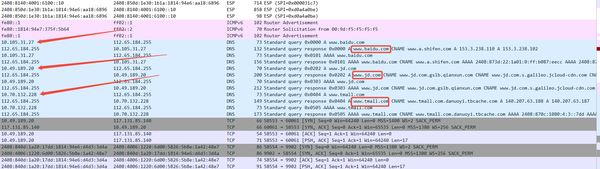
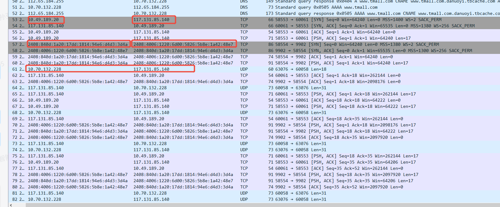
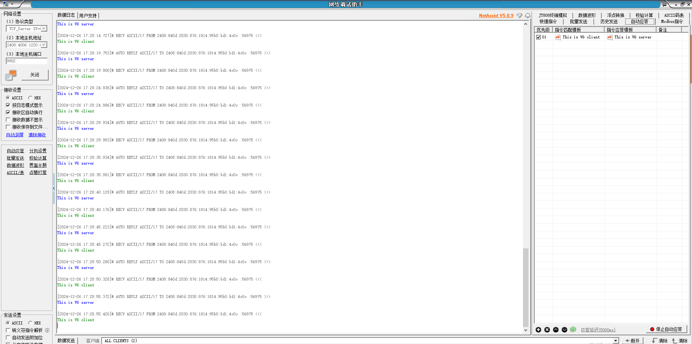
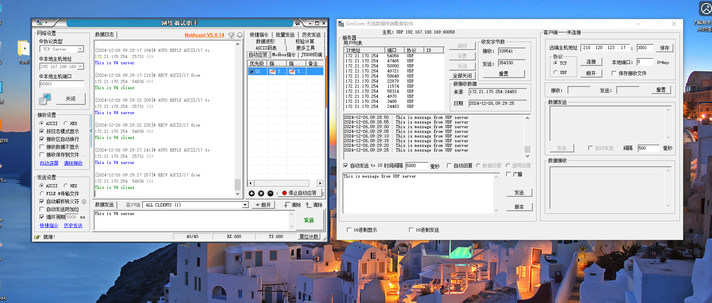

# Multiple PDP Application

The customer's application requires the simultaneous use of multiple APNs (such as the mixed use of public and private networks). In this case, it is planned to use 4 PDP channels respectively for 4 different APNs. The first channel serves as RNDIS, the second channel as PPP dial-up, and the third channel creates a TCP connection, sends data at regular times, and returns the received data. The fourth path creates a UDP link, sends data at regular intervals, and returns the received data. It is required to reflect the distribution of IP data links obtained by different PDP in wireshark. Different PDP services use the DNS they obtain to resolve the host name. It is very challenging but also very meaningful.
<br>

Create the following structure array, configure the iptype and APN of the 4-channel PDP, and uniformly manage the 4-channel PDP.
```c
static SC_PdpConfig PdpContentGroup[] =
{
    {{SC_PDP1,    SC_PDPTYPE_IPV4V6 , "3gnet"},   NULL ,NULL},
    {{SC_PDP2,    SC_PDPTYPE_IPV4V6 , "APN2"},    NULL ,NULL},
    {{SC_PDP3,    SC_PDPTYPE_IPV4V6 , "APN3"},    NULL ,NULL},
    {{SC_PDP4,    SC_PDPTYPE_IPV4V6 , "APN4"},    NULL ,NULL},
};
```

When using network-related apis, for newer SDKS, sAPI_NetworkInit() must be initialized; Otherwise, the apis related to obtaining and setting PDP and the network will not be able to be used normally.

Configure APN with sAPI_NetworkSetCgdcont, and then query the network status through sAPI_NetworkGetCpsi or sAPI_NetworkGetCgreg. Then, it is necessary to determine whether sAPI_NetworkSetCgact is needed to activate the corresponding PDP based on the current status of PDP CGACT.

After activating PDP, use sAPI_TcpipGetSocketPdpAddr to obtain the IPV4 and IPV6 addresses of each PDP. Subsequently, TCP/UDP socket connections will bind different V4 / V6 addresses.

For testing purposes, gethostbyname_with_pcid is used to resolve all IP addresses corresponding to the domain name as follows using different PDP Cids respectively.
```c
char *DomainName[]={"www.baidu.com", "www.simcom.com", "www.jd.com" ,"www.tmall.com"};
```

Create the sockets of TCP and UDP, and allow the binding of the corresponding PDP IP, then perform data sending and receiving, capture CATSTUDIO logs, and filter wireshark packets. The configuration is as follows. Use PDP3 to create two TCP client connections, which are respectively connected to the servers of V4 and V6, and use PDP4 to create one UDP client connection.
```c
#define TCP_DEFAULT_SERVER        "117.131.85.140"
#define TCP_DEFAULT_SERVER_PORT   60061


#define TCP_DEFAULT_V6SERVER      "2408:4006:1220:6d00:5826:5b8e:1a42:48e7"
#define TCP_DEFAULT_V6SERVER_PORT  9902

#define UDP_DEFAULT_SERVER        "117.131.85.140"
#define UDP_DEFAULT_SERVER_PORT   60058

#define TCP_SOCKET_CID            3
#define UDP_SOCKET_CID            4
```

The test demo first registers the network. PDP1 - PDP4 respectively set APN 3gnet\APN2\APN3\APN4, and then waits for registration. Use CGACT to activate and obtain the IPV4\V6 addresses corresponding to PDP respectively. Then, use PDP1- PDP4 respectively to perform addrinfo parsing on the following servers. Then use the PDP3 create TCP v4 socket (117.131.85.140:60061) and the v6 socket (2408:4006-1220:6 d00:5826:5 b8e: 1 a42:48 e7, port 9902), Create a UDP socket(117.131.85.140:60058) using PDP4, and then use the same task for data transmission and reception. After two TCP Sockets establish a connection, they will send "This is V4(V6) client", and the corresponding response from the server is "This is V4(V6) Server". The UDP server receives the data "This is message from UDP After "client", "This is message from UDP server" will be sent to the module.
```
char *DomainName[]={"www.baidu.com", "112.74.93.163", "www.jd.com" ,"www.tmall.com"};
```

From following logs we see the IP address for the 4 PDPs:
```c
PDP1:
IPV4 addr:10.105.31.27          IPV6 addr:2408:840d:1e00:3fc:1814:94e6:75cf:c21b
PDP2:
IPV4 addr:10.68.47.19            IPV6 addr:2408:840d:1c30:b8:1814:94e7:375f:5b64
PDP3:
IPV4 addr:10.49.189.20          IPV6 addr:2408:840d:1a20:17dd:1814:94e6:d4d3:3d4a
PDP4:
IPV4 addr:10.70.132.228         IPV6 addr:2408:840d:1c20:11a3:1814:94e6:f670:971

I/elog [1970/01/01 00:00:09 ] EasyLogger V2.2.99 is initialize success.
I/NO_TAG [1970/01/01 00:00:09 ] [multipdp_task_create] 855 <--> MpdpInit
I/NO_TAG [1970/01/01 00:00:09 ] [multipdp_task_create] 860 <--> multipdp_task_create status = 0
I/NO_TAG [1970/01/01 00:00:10 ] [multipdp_thread] 794 <--> NetworkMode->No Service,Online,cgreg->0
I/NO_TAG [1970/01/01 00:00:11 ] [multipdp_thread] 794 <--> NetworkMode->LTE,Online,cgreg->1
I/NO_TAG [1970/01/01 00:00:15 ] [get_pdp_ip_contents] 182 <--> PDP1 IPV4V6
I/NO_TAG [1970/01/01 00:00:15 ] [printSockAddr] 137 <--> IPV4 addr:10.105.31.27 port:0
I/NO_TAG [1970/01/01 00:00:15 ] [printSockAddr] 143 <--> IPV6 addr:2408:840d:1e00:3fc:1814:94e6:75cf:c21b port:0
I/NO_TAG [1970/01/01 00:00:15 ] [get_domain_ip_with_pdp] 255 <--> Parse domain "www.baidu.com"
I/NO_TAG [1970/01/01 00:00:15 ] [get_domain_ip_with_pdp] 264 <--> domain ipv4 address->153.3.238.110
I/NO_TAG [1970/01/01 00:00:15 ] [get_domain_ip_with_pdp] 264 <--> domain ipv4 address->153.3.238.102
I/NO_TAG [1970/01/01 00:00:15 ] [get_domain_ip_with_pdp] 271 <--> domain ipv6 address->2408:873d:22:1a01:0:ff:b087:eecc
I/NO_TAG [1970/01/01 00:00:15 ] [get_domain_ip_with_pdp] 271 <--> domain ipv6 address->2408:873d:22:18ac:0:ff:b021:1393
I/NO_TAG [1970/01/01 00:00:15 ] [get_pdp_ip_contents] 182 <--> PDP2 IPV4V6
I/NO_TAG [1970/01/01 00:00:15 ] [printSockAddr] 137 <--> IPV4 addr:10.68.47.19 port:0
I/NO_TAG [1970/01/01 00:00:15 ] [printSockAddr] 143 <--> IPV6 addr:2408:840d:1c30:b8:1814:94e7:375f:5b64 port:0
I/NO_TAG [1970/01/01 00:00:15 ] [get_domain_ip_with_pdp] 255 <--> Parse domain "112.74.93.163"
I/NO_TAG [1970/01/01 00:00:15 ] [get_domain_ip_with_pdp] 264 <--> domain ipv4 address->112.74.93.163
I/NO_TAG [1970/01/01 00:00:15 ] [get_pdp_ip_contents] 182 <--> PDP3 IPV4V6
I/NO_TAG [1970/01/01 00:00:15 ] [printSockAddr] 137 <--> IPV4 addr:10.49.189.20 port:0
I/NO_TAG [1970/01/01 00:00:15 ] [printSockAddr] 143 <--> IPV6 addr:2408:840d:1a20:17dd:1814:94e6:d4d3:3d4a port:0
I/NO_TAG [1970/01/01 00:00:15 ] [get_domain_ip_with_pdp] 255 <--> Parse domain "www.jd.com"
I/NO_TAG [1970/01/01 00:00:15 ] [get_domain_ip_with_pdp] 264 <--> domain ipv4 address->101.69.205.133
I/NO_TAG [1970/01/01 00:00:15 ] [get_domain_ip_with_pdp] 271 <--> domain ipv6 address->2408:8740:71fc:404:8000::133
I/NO_TAG [1970/01/01 00:00:15 ] [get_pdp_ip_contents] 182 <--> PDP4 IPV4V6
I/NO_TAG [1970/01/01 00:00:15 ] [printSockAddr] 137 <--> IPV4 addr:10.70.132.228 port:0
I/NO_TAG [1970/01/01 00:00:15 ] [printSockAddr] 143 <--> IPV6 addr:2408:840d:1c20:11a3:1814:94e6:f670:971 port:0
I/NO_TAG [1970/01/01 00:00:15 ] [get_domain_ip_with_pdp] 255 <--> Parse domain "www.tmall.com"
I/NO_TAG [1970/01/01 00:00:15 ] [get_domain_ip_with_pdp] 264 <--> domain ipv4 address->140.207.63.188
I/NO_TAG [1970/01/01 00:00:15 ] [get_domain_ip_with_pdp] 264 <--> domain ipv4 address->140.207.63.187
I/NO_TAG [1970/01/01 00:00:15 ] [get_domain_ip_with_pdp] 271 <--> domain ipv6 address->2408:870c:1080:4:3::7dd
I/NO_TAG [1970/01/01 00:00:15 ] [get_domain_ip_with_pdp] 271 <--> domain ipv6 address->2408:870c:1080:4:3::7dc
I/NO_TAG [1970/01/01 00:00:15 ] [tcp_socket_connect] 515 <--> tcp host ipv4
I/NO_TAG [1970/01/01 00:00:15 ] [printSockAddr] 137 <--> IPV4 addr:117.131.85.140 port:60061
I/NO_TAG [1970/01/01 00:00:15 ] [tcp_socket_connect] 534 <--> tcp connect v4 server sucess
I/NO_TAG [1970/01/01 00:00:15 ] [tcp_socket_connect] 549 <--> tcp host ipv6
I/NO_TAG [1970/01/01 00:00:15 ] [printSockAddr] 143 <--> IPV6 addr:2408:4006:1220:6d00:5826:5b8e:1a42:48e7 port:9902
I/NO_TAG [1970/01/01 00:00:15 ] [tcp_socket_connect] 566 <--> tcp connect v6 server sucess
I/NO_TAG [1970/01/01 00:00:15 ] [udp_client_init] 679 <--> udp host ipv4
I/NO_TAG [1970/01/01 00:00:15 ] [printSockAddr] 137 <--> IPV4 addr:117.131.85.140 port:60058
I/NO_TAG [1970/01/01 00:00:15 ] [printSockAddr] 137 <--> IPV4 addr:10.70.132.228 port:0
I/NO_TAG [1970/01/01 00:00:20 ] [tcp_poll] 302 <--> tcp v4 recvfrom fd 18
I/NO_TAG [1970/01/01 00:00:20 ] [tcp_poll] 324 <--> tcp v4 17 bytes recv from [117.131.85.140]:60061 data:This is V4 server
I/NO_TAG [1970/01/01 00:00:20 ] [tcp_poll] 398 <--> udp recvfrom fd 20
I/NO_TAG [1970/01/01 00:00:20 ] [tcp_poll] 420 <--> udp 31 bytes recv from [117.131.85.140]:60058 data:This is message from UDP server
I/NO_TAG [1970/01/01 00:00:20 ] [tcp_poll] 424 <--> udp sendback 31 bytes
I/NO_TAG [1970/01/01 00:00:20 ] [trace_taskinfo] 868 <--> sockrecv_stack(S:8188 U:576 P:1052)
I/NO_TAG [1970/01/01 00:00:20 ] [trace_taskinfo] 868 <--> mpdp_cli_stack(S:4092 U:456 P:2064)
I/NO_TAG [1970/01/01 00:00:20 ] [tcp_poll] 348 <--> tcp v6 recvfrom fd 19
I/NO_TAG [1970/01/01 00:00:20 ] [tcp_poll] 370 <--> tcp v6 17 bytes recv from [2408:4006:1220:6d00:5826:5b8e:1a42:48e7]:9902 data:This is V6 server
I/NO_TAG [1970/01/01 00:00:22 ] [tcp_poll] 398 <--> udp recvfrom fd 20
I/NO_TAG [1970/01/01 00:00:22 ] [tcp_poll] 420 <--> udp 31 bytes recv from [117.131.85.140]:60058 data:This is message from UDP server
I/NO_TAG [1970/01/01 00:00:22 ] [tcp_poll] 424 <--> udp sendback 31 bytes
I/NO_TAG [1970/01/01 00:00:25 ] [tcp_poll] 302 <--> tcp v4 recvfrom fd 18
I/NO_TAG [1970/01/01 00:00:25 ] [tcp_poll] 324 <--> tcp v4 17 bytes recv from [117.131.85.140]:60061 data:This is V4 server
I/NO_TAG [1970/01/01 00:00:25 ] [trace_taskinfo] 868 <--> sockrecv_stack(S:8188 U:576 P:1184)
I/NO_TAG [1970/01/01 00:00:25 ] [trace_taskinfo] 868 <--> mpdp_cli_stack(S:4092 U:436 P:2064)
I/NO_TAG [1970/01/01 00:00:25 ] [tcp_poll] 348 <--> tcp v6 recvfrom fd 19
I/NO_TAG [1970/01/01 00:00:25 ] [tcp_poll] 370 <--> tcp v6 17 bytes recv from [2408:4006:1220:6d00:5826:5b8e:1a42:48e7]:9902 data:This is V6 server
I/NO_TAG [1970/01/01 00:00:27 ] [tcp_poll] 398 <--> udp recvfrom fd 20
I/NO_TAG [1970/01/01 00:00:27 ] [tcp_poll] 420 <--> udp 31 bytes recv from [117.131.85.140]:60058 data:This is message from UDP server
I/NO_TAG [1970/01/01 00:00:27 ] [tcp_poll] 424 <--> udp sendback 31 bytes

```

From the wireshark screenshot, it can be seen that in the following domain name usage, the corresponding PDP was used respectively.

<br>

When establishing TCP/UDP connections, the address establishment of PDP3 V4 / PDP3 V6 / PDP4 V4 was used respectively, and the data transmission and reception were also corresponding. It proved that the experiment completely verified the demo purpose.<br>





